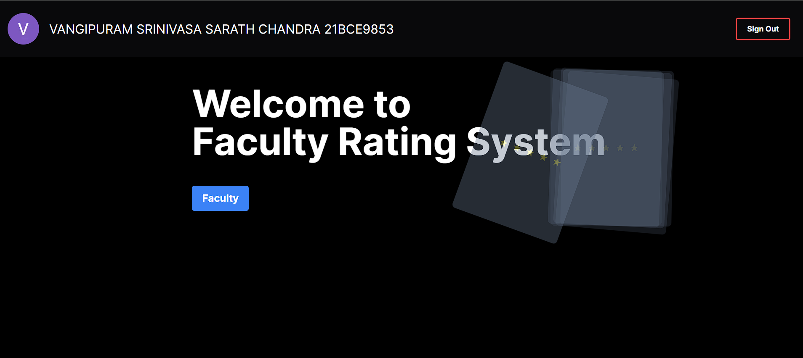

# Faculty Ranker

Faculty Ranker is a modern web application for exploring faculty profiles, browsing ratings, and discovering academic insights in a polished and responsive interface. The project is built with Next.js and Tailwind CSS and is designed to feel fast, clear, and easy to navigate.

## Features

- Browse a curated list of faculty members
- Search faculty by name or specialization
- View detailed faculty profiles with rating summaries
- Navigate through paginated faculty results
- Experience a glassmorphism-inspired UI with responsive layouts
- Use a clean home page and dedicated faculty listing experience

## Tech Stack

- Next.js 13
- React 18
- TypeScript
- Tailwind CSS
- Firebase
- Vercel-ready deployment setup

## Project Structure

- src/app - Main app pages and route-level UI
- src/components - Reusable UI components such as cards and image fallbacks
- src/firebase - Firebase integration helpers
- src/types - Shared TypeScript types
- scrapper - Data collection scripts and utilities

## Getting Started

### Prerequisites

- Node.js 20.x
- npm

### Installation

```bash
npm install
```

### Run locally

```bash
npm run dev
```

Then open http://localhost:3000 in your browser.

If you want to use a different port, you can run:

```bash
npm run dev -- --port 3001
```

## Available Scripts

- npm run dev - Start the development server
- npm run build - Create a production build
- npm run start - Start the production build locally
- npm run lint - Run Next.js lint checks

## Notes

The app uses a combination of local faculty data and Firebase-backed details for the experience. The interface is designed to be easy to extend if you want to add authentication, richer analytics, or more faculty metadata later.

## Demo

